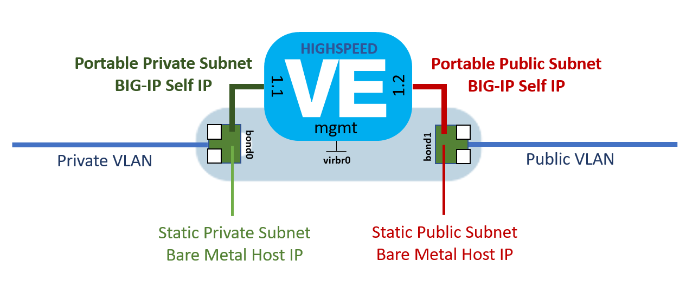

# f5-ibmbluemix
cloud-init based onboarding of TMOS Virtual Edition for IBM Cloud instances.

These instuctions are for the base onboarding of TMOS Virtual Edition in the IBM Cloud environemnt. Once TMOS devices are created in the cloud environment, both [f5-cloud-libs](https://github.com/F5Networks/f5-cloud-libs) and [f5-ansible](https://github.com/F5Networks/f5-ansible) libraries can be used to perform additional provisioning automation.

TMOS Virtual Editions can be launched with Virtual Hosts for performance under 1Gbps, and as instances running on Bare Metal hosts for performance in excess of 1Gbps. The processes for onboarding TMOS Virtual Edition into IBM Cloud are detailed below.

# Launching TMOS Virtual Edition as a IBM Cloud Virtual Host

IBM Cloud offers the ability to order Virtual Hosts with various options and utilizations. The sizing of the virtual host will be dependant on which TMOS Virtual Edition you are creating in the IBM Cloud.

The proceedure for creating a TMOS Virtual Edition breaks into two stages:

### Steps Performed Once Per Each TMOS Virtual Edition Image Version

1. Obtain the TMOS Virtual Edition VHD Disk Images
2. Create Object Storage for the TMOS Disk Images
3. Upload TMOS Disk Images into Object Storage
3. Create a Disk Image from Object Storage

### Steps Performed When Launching Each TMOS Virutal Edition

1. Download and Customize Your cloud-init User Data File
2. Creating a TMOS Virtual Edition Virtual Machine

## Obtaining TMOS Virtual Edition VHD Disk Images

F5 TMOS Virtual Edition disk images can be obtained from [https://downloads.f5.com](https://downloads.f5.com). Please contact your account representatives if you have any questions about TMOS Virtual Edition licensing or download options.

**These cloud-init based templates are only intended for TMOS Virtual Edition version 13.1 or higher. The required cloud-init functionality is not available before TMOS Virtual Edition version 13.1. Do not attempt to use these templates with TMOS Virtual Editions prior to the 13.1 release.**

To determine which TMOS Virtual Edition you will need to properly support the F5 functionality and performance desired, the following guides have been prepared:

[Overview of BIG-IP VE image sizes](https://support.f5.com/csp/article/K14946)

[Overview of BIG-IP VE license and throughput limits](https://support.f5.com/csp/article/K14810)

[Environmental setup for evaluating performance on the BIG-IP Virtual Edition system](https://support.f5.com/csp/article/K17160)

Due to limitations with the virtualized networking, only TMOS Virtual Editions rated at or below 1Gbps throughput are supported as IBM Cloud Virtual Hosts. For performance rates greater than 1Gps, Bare Metal instances with the high-performance KVM virtual machine manager can be utilized.

IBM Cloud requires the use of the VHD disk image format for their Virtual Hosts. Please assure that you have downloaded the correct VHD TMOS Virtual Edition disk images.

To create a TMOS Virtual Editional instance as an IBM Cloud Virtual Host, you will be downloading the vhd disks labeled as `BIGIP-[version].[TMOS Edition].vhd.zip`. As an example for the LTM 1SLOT TMOS edition of TMOS version 13.1.0.3.0.0.5, you would download the `BIGIP-13.1.0.3.0.0.5.LTM_1SLOT.vhd.zip`.

The md5 hash for each TMOS Virtual edition zip archive is available and it is highly recommended that the hash be validated to assure the local download has completed successfully.

Once you have downloaded your TMOS Virtual Edition VHD disk image zip archive file, you will need to uncompress it. The download is maintained as a standard zip file archive and can be uncompressed with standard unzip utilities. *You will be uploading the uncompressed VHD image file, not the downloaded zip archive.*

## Creating Object Storage for the TMOS Disk Images

In order to make your TMOS Virtual Edition disk image available for use with an IBM Cloud Virtual Host, you must first make your TMOS Virtual Edition disk image available to the IBM Cloud internal image import system. This is done by creating a IBM Cloud Swift Object Storage container and uploading your TMOS Virtual Edition disk image  into the container. Documentation for using IBM Cloud Swift object storage can be found at the following links:

[IBM Cloud Storage - Object Storage](https://console.bluemix.net/docs/infrastructure/objectstorage-swift/index.html#getting-started-with-object-storage-openstack-swift)

[How do I access object storage by the command line?](http://knowledgelayer.softlayer.com/es/procedure/how-do-i-access-object-storage-command-line)

## Uploading TMOS Disk Images to Object Storage

The IBM Cloud web portal does not support the uploading of storage objects which are larger then 20M bytes. In order to upload your TMOS Virtual Edition VHD disk image, you will need to use one of the upload clients documented by IBM. Here are a few options:

[Connecting to Object Storage OpenStack Swift using Cyberduck](https://console.bluemix.net/docs/infrastructure/objectstorage-swift/connect-object-storage-using-cyberduck.html#connecting-to-object-storage-openstack-swift-using-cyberduck)

[Softlayer Github Repository - Bash and Python examples](https://softlayer.github.io/python/swiftUploader/)

## Creating a Disk Image from Object Storage

Once the TMOS Virtual Edition VHD disk image is uploaded into object storage, the Virtual Host image system can import it. Imported images can then be used to launch multiple TMOS Virtual Edition instances as Virtual Hosts. This step can be completed through the IBM Cloud web portal, CLI tools, or through the Soft Layer API.

[Importing an Image](https://console.bluemix.net/docs/infrastructure/image-templates/import-image.html#importing-an-image)

It is recommended that you use F5 Virtual Edition disk image naming convention when creating your images in the Object Storage service. As an example for the `BIGIP-13.1.0.3.0.0.5.LTM_1SLOT.vhd` image, the recommended Image name would be `BIGIP-13.1.0.3.0.0.5.LTM_1SLOT`. Following this suggestion will allow for future TMOS Virtual Edition images to be imported without confusion to naming collisions.

## Downloading and Customizing the cloud-init User Data File

F5 TMOS Networking utilizes the high-performance Traffic Management Microkernel (TMM) rather then standand server networking components. The IBM Cloud Virtual Host provisioning process is designed to create standard Linux and Windows based network configurations where as TMOS provisions TMM interfaces, VLANs, and Self-IPs. In order to accept the network configuration provided by the IBM Cloud Virtual Host provision system and transform that information into the appropriate TMM objects, a cloud-init onboarding process is utilized. Cloud-init is the industry standard for cloud serer onboarding and is supported in TMOS v13.1+.

This repository contains the cloud-init user_data file required to provision the IBM Cloud `Private and Public`, and `Private Only` networking models on TMOS Virtual Editions.

To obtain the user_data file for your TMOS Virtual Edition instance, download the [ibm_init_userdata.txt](https://raw.githubusercontent.com/jgruber/f5-ibmbluemix/master/ibm_init_userdata.txt) file from this repository.

### Customized Settings in the User Data File

The only customized setting in the user_data file are the values used for the built in `admin` and `root` passwords of your instance. All other provisioning artifacts, network settings, and SSH keys, are derived from the IBM Cloud settings.

Editing the downloaded `ibm_init_userdata.txt` file with your preferred text editor, change the `__TMOS_ADMIN_PASSWORD__` and `__TMOS_ROOT_PASSWORD__` fields in the file to your desired values for this specific TMOS Virtual Edition instances. Here is an example using the standard Unix `sed` editor.

```
sed -i -e "s/__TMOS_ADMIN_PASSWORD__/ibmsoftlayer/g" ibm_init_userdata.txt
sed -i -e "s/__TMOS_ROOT_PASSWORD__/ibmsoftlayer/g" ibm_init_userdata.txt
sed -i -e "s/__TMOS_LICENSE_BASEKEY__/GRUB1-KPKXB-PY867-5309O-CMUWAQY/g" ibm_init_userdata.txt
sed -i -e "s#__TMOS_AS3_URL__#https://github.com/F5Networks/f5-appsvcs-extension/releases/download/3.0.0/f5-appsvcs-3.0.0-34.noarch.rpm#g" ibm_init_userdata.txt
```
If the IBM Cloud Virtual Host is deployed with private only networking, then public network basekey licensing will not work. You should set the license basekey to an empty string.

```
sed -i -e "s/__TMOS_LICENSE_BASEKEY__//g" ibm_init_userdata.txt
```
If the IBM Cloud Virtual Host is deployed with private only networking, then the AS3 iControlLX service extensions URL can either be set to a private network reachable URL or else a blank string to disable the installation.

```
sed -i -e "s/__TMOS_AS3_URL__//g" ibm_init_userdata.txt
```

It is of note that the TMM Self-IPs are provisioned to `allow-all` services initially. The security of these interfaces can be tightened when additional services and settings are provisioned in later stage orchestration. F5 supports later stage orchestration through the use of our [f5-ansible](https://github.com/F5Networks/f5-ansible) modules and [TMOS REST APIs](https://devcentral.f5.com/wiki/iControlREST.HomePage.ashx).

In addition, because there are multiple license activation options, TMOS license orchestration has also been deferred to later stage orchestration. F5 provides various license orchestration methods through both our [f5-cloud-libs](https://github.com/F5Networks/f5-cloud-libs) libraries and our [BIG-IQ APIs](https://devcentral.f5.com/wiki/BIGIQ.HowToSamples_license_member_management.ashx).

## Creating a TMOS Virtual Edition Virtual Machine

The IBM Cloud web portal will try to limit the size of the Virtual Host initial disk based on the size of the Image you imported. Because all the disk images are less than 25GB, the Virtual Host created using the Image through the port will only allow for 25GB disk images. The disk images sized for TMOS Virtual Edition are documented in the following article:

[Overview of BIG-IP VE image sizes](https://support.f5.com/csp/article/K14946)

and summarized in the table below for TMOS version 13.1

Image Type    |  Downloaded Disk Size | Running Disk Size Required | IBM Cloud Disk Size
--- | --- | --- | ---
LTM_1SLOT | 5.1 GB | 9 GB | 25 GB
LTM | 5.1 GB | 40 GB | 100 GB
ALL | 6.2 GB |82 GB | 100 GB
ALL_1SLOT | 6.2 GB |60 GB | 100 GB

What this effectively means is that your Virtual Host for all but LTM_1SLOT images must use a CLI or API client to create the Virtual Host with the appropriate disk size.

Once the TMOS Virtual Edition is launched and has completed intialization, it will display like any other Virtual Host in the IBM Cloud web portal, CLI, or API. To access the TMOS Virtual Edition simply `ssh` as root to the Virtual host's private IP address or login to the TMOS Web Inteface at `https://[private_ip_address]:8443`.

# Launching TMOS Virtual Edition on a IBM Cloud Bare Metal Host

The proceedure for creating a TMOS Virtual Edition for Bare Metal installation is as follows:

### Steps Performed When Launching Each TMOS Virutal Edition

1. Order the appropriate CentOS 7.x minimal Bare Metal host with bonded (redundant) network interfaces
2. Order the appropriate portable subnets for BIG-IP usage
3. Download your TMOS Virtual Edition QCOW disk image to your Bare Metal host
4. Download and Customize the TMOS Virtual Edition install script from this repo
5. Run the TMOS Virtual Edition install script

## Ordering a Bare Metal Server

The TMOS Virtual Edition install script assume the software packaging tools and packages associated with Red Hat Linux version 7 are available to your Bare Metal host. The installation script was tested with the IBM Cloud Bare Metal CentOS 7.x minimal OS install image.

Bare Metal hosts with the `Private and Public` networking models have access to download the necessary packages for the high-performance KVM virtual machine manager environment. In addition to the softare install packages, the host must have access to the URLs specified in the installation script to download the TMOS Virtual Edition qcow2 disk image, KVM environment template, and the user_data file template. The `Private Only` networking model is not recommended.


## Obtaining TMOS Virtual Edition QCOW Disk Images

F5 TMOS Virtual Edition disk images can be obtained from [https://downloads.f5.com](https://downloads.f5.com). Please contact your account representatives if you have any questions about TMOS Virtual Edition licensing or download options.

**These cloud-init based templates are only intended for TMOS Virtual Edition version 13.1 or higher. The required cloud-init functionality is not available before TMOS Virtual Edition version 13.1. Do not attempt to use these templates with TMOS Virtual Editions prior to the 13.1 release.**

To determine which TMOS Virtual Edition you will need to properly support the F5 functionality and performance, the following guides have been prepared:

[Overview of BIG-IP VE image sizes](https://support.f5.com/csp/article/K14946)
[Overview of BIG-IP VE license and throughput limits](https://support.f5.com/csp/article/K14810)

The KVM domain enviroment to launch your TMOS Virtual Edition has been templated to allow for ease in tuning. The template utilizes high-speed paravirtualized network interfaces for speeds in excess of 10Gbps. TMOS Virtual Edition performance will be entirely dependant on the Bare Metal device ordered and should follow the guidlines found here:

[Environmental setup for evaluating performance on the BIG-IP Virtual Edition system](https://support.f5.com/csp/article/K17160)

The md5 hash for each TMOS Virtual edition zip archive is available and it is highly recommended that the hash be validated to assure the local download has completed successfully.

Once you have downloaded your TMOS Virtual Edition qcow2 disk image, you will need to uncompress it. The download is maintained as a standard zip file archive and can be uncompressed with standard unzip utilities. *The installation script will need access to the qcow2 image file, not the downloaded zip archive.* It is the qcow2 disk image from within the zip archive that will be installed on your Bare Metal host.

## Downloading the TMOS Virtual Edition QCOW Disk Image to Your Host

Once you have downloaded the zip file archive from [https://downloads.f5.com](https://downloads.f5.com), extract the qcow2 from the zip archive, and use `scp` (secure copy) to upload the TMOS Virtual Edition disk image to your IBM Cloud Bare Metal host. `ssh` into your host as the `root` user.

## Downloading the TMOS Virtual Edition Installation Script

To obtain the TMOS Virtual Edition installation script file, download the [ibmbm_tmos_ve_install.sh](https://raw.githubusercontent.com/jgruber/f5-ibmbluemix/master/baremetal/ibmbm_tmos_ve_install.sh) file from this repository.

``# wget https://raw.githubusercontent.com/jgruber/f5-ibmbluemix/master/baremetal/ibmbm_tmos_ve_install.sh``

Before running the TMOS Virtual Edition installation script, there are settings which determine which TMOS Virtual Edition disk to download, which virtual machine deployment template, the orchestration template, built in account passwords to set, and the portal subnet addresses to allocation to the BIG-IP during installation. Each of these settings are read as environment variables by the TMOS Virtual Edition installation script.

For each TMOS Virtual Edition being launched, you will need a private portable IP address, netmask, and gateway as well as a public portable IP address, netmask, and gateway. For TMOS Virtual Editions being clustered into a device service group, the addresses should be from the same portable subnets.



An example of exporting the installation script settings environment variables is as follows:

```
export TMOS_ADMIN_PASSWORD=ibmsoftlayer
export TMOS_ROOT_PASSWORD=ibmsoftlayer

export BIGIP_UNZIPPED_QCOW_IMAGE_URL=file:///tmp/BIGIP-13.1.0.3.0.0.5.qcow2
export TMOS_VE_DOMAIN_TEMPLATE="https://raw.githubusercontent.com/jgruber/f5-ibmbluemix/master/baremetal/ve_domain_3_nic_virtio_mq_xml.tmpl"
export USER_DATA_URL="https://raw.githubusercontent.com/jgruber/f5-ibmbluemix/master/baremetal/ibm_init_userdata.txt"

export PORTABLE_PUBLIC_ADDRESS=169.60.155.27
export PORTABLE_PUBLIC_NETMASK=255.255.255.240
export PORTABLE_PUBLIC_GATEWAY=169.60.155.19

export PORTABLE_PRIVATE_ADDRESS=10.182.41.101
export PORTABLE_PRIVATE_NETMASK=255.255.255.192
export PORTABLE_PRIVATE_GATEWAY=10.182.41.65

export TMOS_LICENSE_BASEKEY=GRUB1-KPKXB-PY867-5309O-CMUWAQY

```

You will need to export these environment variables before executing the script. If these variables are not set, their default values are as follows:

Env Variable    |  Default | Description
--- | --- | --- 
TMOS_ADMIN_PASSWORD | ibmsoftlayer | The value to set the TMOS admin account password
TMOS_ROOT_PASSWORD | ibmsoftlayer | The value to set the TMOS root account password
BIGIP_UNZIPPED_QCOW_IMAGE_URL | file:///tmp/BIGIP-13.1.0.3.0.0.5.qcow2 | The URL location of the TMOS Virtual Edition qcow disk image. This can be http://, https://, or file://. Use file:// if you used another tool to download the TMOS Virtual Edition disk image to the bare metal host.
TMOS_VE_DOMAIN_TEMPLATE | file:///tmp/ve_domain_standard_xml.tmpl | The libvirt domain XML template to use for the TMOS Virtual Edition instance
USER_DATA_URL| file:///tmp/ibm_init_userdata.txt | The cloud-init user_data metadata template to use for TMOS Virtual Edition provisioning
PORTABLE_PUBLIC_ADDRESS| |No networking will be provisioned
PORTABLE_PUBLIC_NETMASK| |No networking will be provisioned
PORTABLE_PUBLIC_GATEWAY| |No networking will be provisioned
PORTABLE_PRIVATE_ADDRESS| |No networking will be provisioned
PORTABLE_PRIVATE_NETMASK| |No networking will be provisioned
PORTABLE_PRIVATE_GATEWAY| |No networking will be provisioned
TMOS_LICENSE_BASEKEY| |No license activation will be attempted

## Running the TMOS Virtual Edition Installation Script

Once the settings environment variables are exported, execute the TMOS Virtual Edition installation script.

``# bash ibmbm_tmos_ve_install.sh``

The Bare Metal host will reboot after installation.

With the use of portable subnets, the Bare Metal host retains all of its originally assigned static network addresses. Access to the Bare Metal host by you or IBM Cloud operations remains unchanged.

By default the provisioning process will set all BIG-IP Self IPs to `allow all`. Once service level provisioning is complete, you will want to secure access to the BIG-IP Self IPs appropriate to their use and access. With the BIG-IP Self IPs allowing all access, the TMOS TMUI Web GUI can be reached on port 443 on either the public or private portable IP addresses provisioned. You can also `ssh` on port 22 to either the public or private portable IP addresses provisioned.

Web GUI access

``https://[portable_ip_address]``

Terminal access

``ssh root@[portable_ip_address]``

Direct console access to the TMOS Virtual Edition can be obtained by access the Bare Metal host via `ssh`, and then access the virtual console by running the following command:

``virsh console $(hostname)``

Even with BIG-IP Self IP secured, console level access is maintained from the Bare Metal host.

If at any point in this process you experience difficulty, simply reload the OS for the Bare Metal device and start over.


